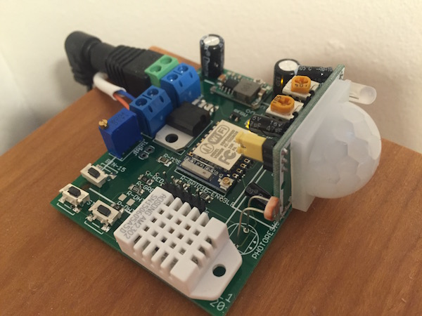

## Garden Variety IoT with Big Data and FRP

Today I put the fountain in my garden under automatic control. It will only run when someone’s home, it’s daytime and obviously, as I live in Finland, when it’s not freezing.


I integrated my fountain pump into my home automation system this with this piece of code (I'll explain it later):

```coffeescript
outdoorTempP = sensors.sensorP({type:"temperature", location: "outdoor"})
dayTimeP = time.hourOfDayP.map((hours) -> hours >= 6 || hours <= 22)
freezingP = outdoorTempP.map((t) -> t < 0)
someoneHomeP = motion.occupiedP("olohuone", time.oneHour * 8)
fountainP = dayTimeP.and(freezingP.not()).and(someoneHomeP)
houm.controlLight "Suihkulähde", fountainP
````

This is possible because I’ve already installed some sensors around my house, measusing things like temperature, 
humidity and lightness here and there. Some sensors I've bought and many have I soldered together from stuff like ESP-8266 or Arduino microcontrollers, Raspberry Pis and numerous sensor modules.
I’ve even designed a printed circuit board that has motion detection and a bunch of measurements. 




Also, I have the [Huom.IO](http://houm.io/en/) lighting control system set up, that allows me to turn 
lights and actually any electric appliances on and off using a simple [API](https://github.com/houmio/houmio-docs/blob/master/apidoc.md).

Because I’m an FRP nerd and happen to have built a [FRP library](https://github.com/baconjs/bacon.js/) of my own a few years ago,
I want to do my automation by combining streams of data using cool stuff like flatMap and combine. So I wrote a simple server (link) platform that allows me to gather the data from my sensors and lighting system and pipe and combine it to control my lighting. And, of course, the fountain.

### FRP IoT

For me, home automation and IoT is about collecting streams of measurement values, storing them for later use and visualization, transforming and combining this data into control streams that can then be fed to actuators such as lighting, pumps and valves. To me, FRP with a library like Bacon.js seems like the perfect fit.

In Bacon.js, we use `EventStreams` to represent distinct events and `Properties` to represent values that change over time. For instance, in my home automation platform, there's an API called `sensors` that will give me any measured value as a Property. So, when I write

```coffeescript
outdoorTempP = sensors.sensorP({type:"temperature", location: "outdoor"})
outdoorTempP.forEach((t) -> console.log("temperature is " + t)
````

... my function on line 2 will be called when the outside temperature property `outdoorTempP` changes and the temperature will be written to standard output. Not very useful yet, but let's add more stuff.

```coffeescript
freezingP = outdoorTempP.map((t) -> t < 0)
dayTimeP = time.hourOfDayP.map((hours) -> hours >= 6 || hours <= 22)
````

Here I've used the `map` method of `outdoorTempP` to transform the temperature values into boolean values so that the new property `freezingP` will hold `true` when temperature outside is freezing (I'm obviously using Celsius degrees here). Then I added a new property `dayTimeP` using a similar `map` call on the `hourOfDayP` property of the `time` API.

Finally, I add one more property from the `motion` API and combine all of the data using boolean logic:

```coffeescript
someoneHomeP = motion.occupiedP("olohuone", time.oneHour * 8)
fountainP = dayTimeP.and(freezingP.not()).and(someoneHomeP)
```

So the final `fountainP` property will hold `true` when it's daytime, not freezing and someone's home. 

Admittedly my "someone home" property is not very accurate, as it's based on whether there's been motion in the livingroom in the last 8 hours. I'll add an outdoor motion sensor later for more accuracy, but this will do for now. It's not fatal to have a fountain running even when I'm not home. But at least it won't be running when I'm on a 2-week vacation in Africa. During which my home automation system will, by the way, give the impression of an occupied house by turning lights on and off every now and then.
