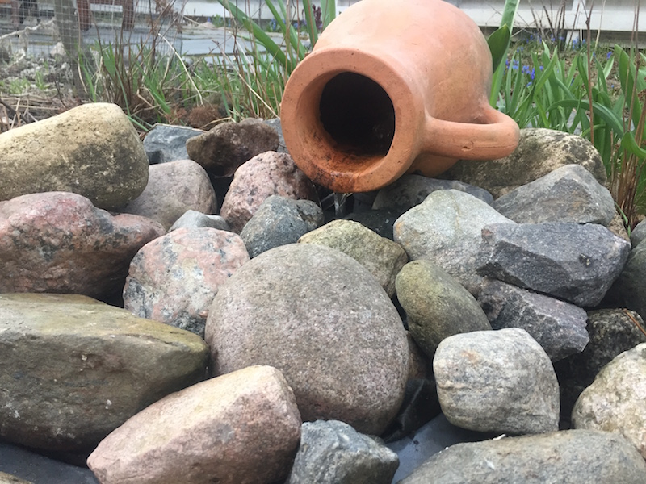

## Garden variety IoT with Big Data and FRP

Today I put the fountain in my garden under automatic control. It will only run when someone’s home, it’s daytime and obviously, as I live in Finland, when it’s not freezing.



I integrated my fountain pump into my home automation system this with this piece of code:

```coffeescript
outdoorTempP = sensors.sensorP({type:"temperature", location: "outdoor"})
dayTimeP = nightTimeP.not()
freezingP = outdoorTempP.map((t) -> t < 0)
someoneHomeP = motion.occupiedP("olohuone", time.oneHour * 8)
fountainP = dayTimeP.and(freezingP.not()).and(someoneHomeP)
houm.controlLight "Suihkulähde", fountainP
````

This is possible because I’ve already installed some sensors around my house, measusing things like temperature, 
humidity and lightness here and there. Some sensors I've bought and many have I soldered together from stuff like ESP-8266 or Arduino microcontrollers, Raspberry Pis and numerous sensor modules.
I’ve even designed a printed circuit board that has motion detection and a bunch of measurements. 


Also, I have the [Huom.IO](http://houm.io/en/) lighting control system set up, that allows me to turn 
lights and actually any electric appliances on and off using a simple [API](https://github.com/houmio/houmio-docs/blob/master/apidoc.md).

Because I’m an FRP nerd and happen to have built a [FRP library](https://github.com/baconjs/bacon.js/) of my own a few years ago,
I want to do my automation by combining streams of data using cool stuff like flatMap and combine. So I wrote a simple server (link) platform that allows me to gather the data from my sensors and lighting system and pipe and combine it to control my lighting. And, of course, the fountain.
